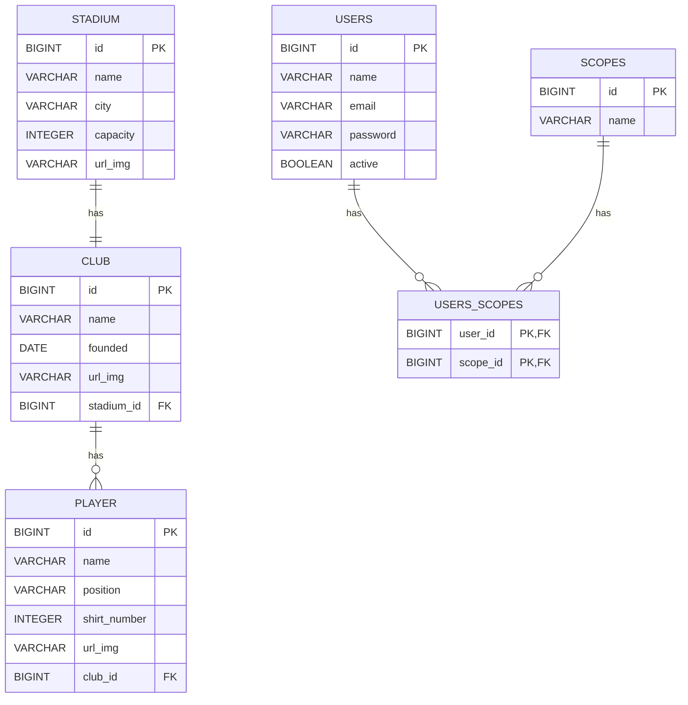

# ⚽ Elifoot

Elifoot é uma aplicação desenvolvida em Java com Spring Boot que simula a gestão de clubes de futebol, incluindo funcionalidades como cadastro de estádios, jogadores, clubes, autenticação e autorização com OAuth2, e controle de permissões via scopes.

## 🔧 Tecnologias

- Java 17
- Spring Boot
- Spring Security + OAuth2 Resource Server
- MapStruct
- Flyway
- Testcontainers
- PostgreSQL
- JUnit 5
- Mockito
- Docker (para ambiente de desenvolvimento/testes)

## ✨ Funcionalidades

- CRUD de Clubes, Estádios e Jogadores
- Relacionamento entre Clubes e Estádios (1:1) e entre Clubes e Jogadores (1:N)
- Autenticação e autorização com Spring Security + OAuth2
- Controle de acesso por *scopes* (`club:read`, `player:write`, etc.)
- Conversão de entidades e DTOs com MapStruct
- Validação global com `@ControllerAdvice`
- Migrations com Flyway
- Testes unitários com JUnit

## 🔐 Segurança

O sistema utiliza OAuth2 com *JWT Bearer Token* e validação baseada em *scopes*, incluindo anotação personalizada `@CanReadClub`.

### Exemplo de Scopes

- `club:read`
- `club:write`
- `player:read`
- `player:write`
- `admin:all`

## 🧱 Diagrama do Banco de Dados



## 🚀 Como rodar o projeto

1. Clone o repositório:

```bash
git clone https://github.com/renanlessa/elifoot.git
```

2. Rode a aplicação:

```bash
./mvnw spring-boot:run
```

3. Acesse: `http://localhost:8080`

## 📡 Endpoints da API

| Método | Caminho               | Descrição                    |
|--------|-----------------------|------------------------------|
| GET    | `/enums/positions`    | Listar posições de jogadores |
| GET    | `/stadiums`           | Lista estádios (paginado)    |
| POST   | `/stadiums`           | Cria um novo estádio         |
| GET    | `/clubs`              | Lista clubes (paginado)      |
| POST   | `/clubs`              | Cria um novo clube           |
| GET    | `/clubs/{id}`         | Obter clube por id           |
| GET    | `/clubs/{id}/players` | Listar jogadores do clube    |
| GET    | `/players`            | Lista jogadores (paginado)   |
| POST   | `/players`            | Cria um novo jogador         |
| GET    | `/players/{id}`       | Obter jogador por id         |
| POST   | `/login`              | Autenticar usuário           |
| POST   | `/users`              | Cria um novo usuário         |


## ✅ Testes

O projeto possui diferentes tipos de testes organizados por camada da aplicação:

### 🔸 Testes de Integração

- Realizados com **Testcontainers**, utilizando um banco PostgreSQL real em contêiner.
- Validam o comportamento de ponta a ponta das controllers.
- Autenticação é simulada com a anotação `@WithMockUser`.
- Cobrem casos de sucesso e falhas como:
    - Respostas com escopos ausentes (sem permissão).
    - Validações de campos obrigatórios via Bean Validation.
    - Respostas paginadas (com `PagedModel`).

**Exemplo de classes testadas:**
- `StadiumControllerTest`
    - Criação de estádio (`POST /stadiums`)
    - Listagem paginada de estádios (`GET /stadiums`)
    - Teste de acesso negado por falta de escopo

### 🔸 Testes Unitários com Mockito

- Isolam a lógica de negócios nas classes de serviço.
- Dependências externas (repositórios e mappers) são mockadas.
- Valida o comportamento esperado com uso do `Mockito.verify`, `when` e `assertThat`.

**Exemplo de classe testada:**
- `CreateClubServiceTest`

### 🔸 Testes de Mappers

- Validação das conversões entre DTOs e entidades utilizando os mappers gerados pelo **MapStruct**.
- Exemplo: `ClubMapperTest`, `PlayerMapperTest`

## 📁 Estrutura de pacotes

- `controller`: endpoints REST
- `service`: regras de negócio
- `mapper`: conversões com MapStruct
- `config`: configurações gerais
- `exception`: tratamento global de erros
- `domain`: entidades JPA
- `repository`: acesso a dados

---

### License

MIT License

Copyright (c) 2025 Renan Lessa

Permission is hereby granted, free of charge, to any person obtaining a copy
of this software and associated documentation files (the "Software"), to deal
in the Software without restriction, including without limitation the rights
to use, copy, modify, merge, publish, distribute, sublicense, and/or sell
copies of the Software, and to permit persons to whom the Software is
furnished to do so, subject to the following conditions:

The above copyright notice and this permission notice shall be included in all
copies or substantial portions of the Software.

THE SOFTWARE IS PROVIDED "AS IS", WITHOUT WARRANTY OF ANY KIND, EXPRESS OR
IMPLIED, INCLUDING BUT NOT LIMITED TO THE WARRANTIES OF MERCHANTABILITY,
FITNESS FOR A PARTICULAR PURPOSE AND NONINFRINGEMENT. IN NO EVENT SHALL THE
AUTHORS OR COPYRIGHT HOLDERS BE LIABLE FOR ANY CLAIM, DAMAGES OR OTHER
LIABILITY, WHETHER IN AN ACTION OF CONTRACT, TORT OR OTHERWISE, ARISING FROM,
OUT OF OR IN CONNECTION WITH THE SOFTWARE OR THE USE OR OTHER DEALINGS IN THE
SOFTWARE.
